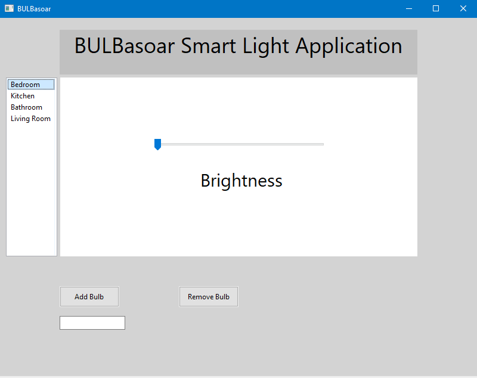
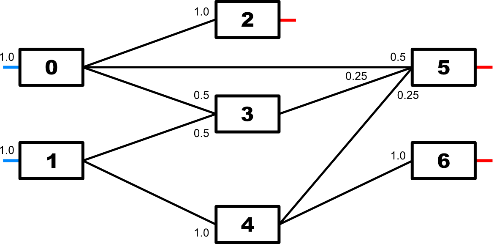
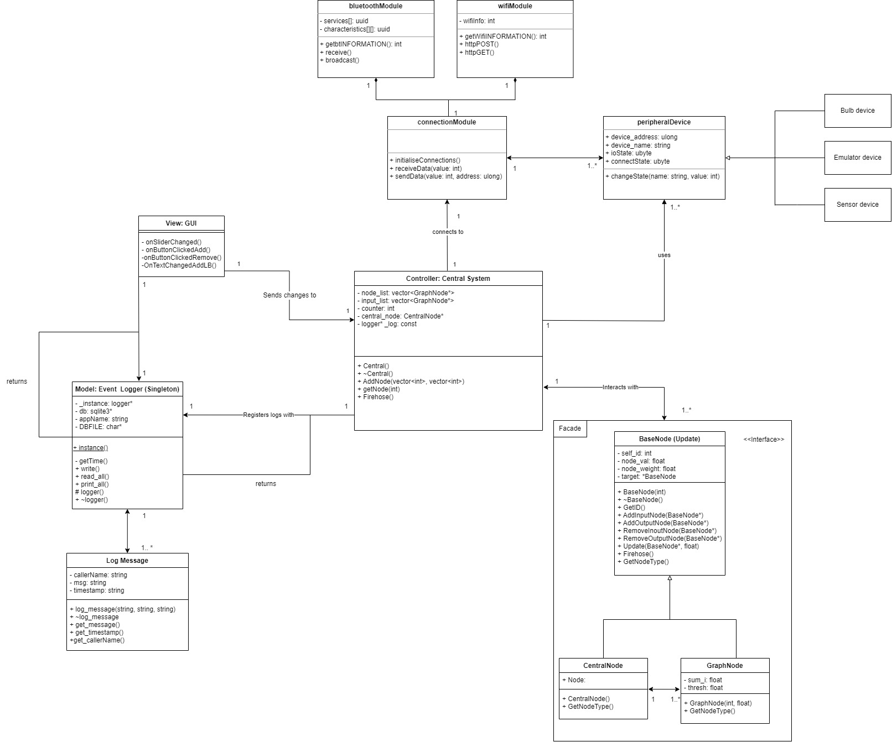

# 3307 Group 12 - BULBasaur <a name="top"></a>
Automated smart home

---

## General project description

Our final goal is to create a system that can take input from multiple sensors and process this data to automatically control lights and other home appliances. The main point of interface is the through the command line directly with the Pi the system will run on, with additional (optional) points of interface such as an app or Windows program, which is currently being worked on.

Most of the processing is done not in the code itself, but rather how the data structures are configured and linked together using a rudimentary neural network. Changes of states in nodes will trigger changes of states in other nodes, and if the final change means a light will turn on, the system will control the light. As of this moment (November 8, 2022), we have finished 4 main sections:

- [Independent GUI on Windows](#gooey)
- [Event logger and retriever](#eventLogger)
- [Node-based logic system](#nodeSystem)
- [Updated UML diagrams](#updatedUML)

---

## Independent GUI <a name="gooey"></a>



This interface will run on a Windows device separate from the main program. As of now, these sections allow the user to select a light and control its brightness. The user can add and remove light bulbs. As of right now it does not connect to the central system, but will eventually link to the actual bluetooth and wifi connected lightbulbs instead of dummy ones. To open the GUI, run the GUI.exe application in the GUI folder. To compile the GUI classes, you will need to install wxWidgets and link it appropriately to App.cpp and MainFrame.cpp.

---

## Event logger and retriever <a name="eventLogger"></a>

An event logger running on sqlite3 processes and stores requests for logs given by other classes. For example, a user inputting their request to turn a light on to a certain level will be logged and stored for the foreseeable future. If the program is ever run in debug mode, the CLI can print these log statements, allowing for easier access to these events and diagnostics. Since this logging functionality is designed for diagnostics in the backend, the GUI will not be designed to support this.

---

## Node-based logic system <a name="nodeSystem"></a>

The node system allows for the complexity of flexible logic to be broken up into multiple sections, or even eliminated entirely depending on how you look at it. By building the logic through linkages of simple node classes, most of the coding can be done through relatively simple and tested processes, such as connecting graphs. The system graph consists of 3 main layers, with an additional interface unit.

The first layer, the input layer, directly takes input from the central system and sends it to root nodes. The most common types of input will likely be input from sensors or emulated sensors external to the system, in the form of light level sensors and manually operated switches. However, the system will likely have its own input values in the form of time and other system events/data.

The middle layer does not have a fixed configuration. In this layer, the nodes created do not have to correspond to a real-world hardware equivalent. These code-only nodes can be set up to perform additional math and conditionals. A potential middle node can be set up as the representation of an entire room with all the lights within it connected as inputs. If any of the lights turn on this node activates, visualising the fact that this room is now lit or active. Other peripheral devices can act off this data, such as closing the blinds or playing music in that specific room without the peripheral devices needing to directly connect to lights. While these middle layers are not strictly necessary, it allows the user to better represent abstract features like rooms and areas within the code.

The final layer, the output layer, takes the output from other nodes into leaf nodes which forward their value back to the central system. While they can also combine multiple outputs from input nodes, their unique purpose is to send a response back to the central system.

While there are different types of nodes, the boundaries between each one is blurred. The layers are more to help the programmer and user visualise the data structures and flow, rather than to help the program run. In fact, input, middle, and output layers are all the same type with the only differentiating aspect found in the nodes they connect to. An output node could connect to the output, and also be connected other downstream nodes as well. The same applies for input nodes.

The interface unit provides a uniform location for all graph nodes to connect to for system input and output. Rather than the system providing the interfaces for the graph nodes to call, they all interact with the central node. This allows the graph nodes and main system to remain untouched if the need for fixes or extensions arises, greatly lowering unnecessary coupling.

The diagram below visualises the current test setup and weights. This tests weights and connections by summing all inputs to 1.00 for each node. If everything works as desired, output nodes 2, 5, and 6 will all output 1.0 to the central system. 



---

## Updated UML diagrams <a name="updatedUML"></a>




---

## Testing Nodes

For testing, please use the test harness `harness.cpp`.

Nodes can be created by calling
```
int Central*->AddNode(vector<int> input_node_ids, vector<float> input_node_weights, vector<int> output_node_ids);
```
which creates the node and initialises its connections, returning the ID of the node created. Please keep in mind that connections to future nodes will be skipped as those nodes do not exist yet. When a connection is made to a node, the corresponding opposite connection is also established.

For debugging purposes, `BaseNode*->Firehose()` can be called to dump the node's connection info into terminal.

## Testing: Logger

For testing the Logger class, please do so through `Central.cpp`.
You will see the testing code for the Singleton Instance and methods commented out in the constructor for `Central.cpp`.
```
    logger::instance();
    // _log->write("Central","I successfully called on logger");
    // _log->print_all();
    // std::vector<log_message> tst = _log->read_all();
```
The write method `write(CallerName, Message)` can be edited by changing the caller name and/or message.

*Preprocessing DEBUG is set up in `logger.h` and can be set to 1 to view intermediate debugging print statements.

---


[^ Back to top ^](#top)
